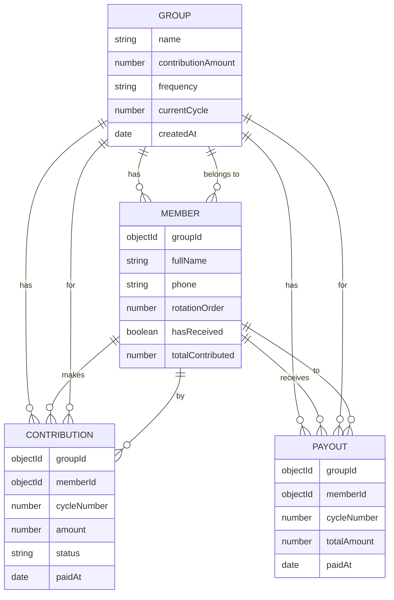

# Database Schema

This document provides an overview of the database schema for the Koota application, represented as an Entity Relationship Diagram (ERD) in Mermaid syntax.

## ERD

```mermaid
erDiagram
    GROUP ||--o{ MEMBER : "has"
    GROUP ||--o{ CONTRIBUTION : "has"
    GROUP ||--o{ PAYOUT : "has"
    MEMBER }o--|| GROUP : "belongs to"
    MEMBER ||--o{ CONTRIBUTION : "makes"
    MEMBER ||--o{ PAYOUT : "receives"
    CONTRIBUTION }o--|| GROUP : "for"
    CONTRIBUTION }o--|| MEMBER : "by"
    PAYOUT }o--|| GROUP : "for"
    PAYOUT }o--|| MEMBER : "to"

    GROUP {
        string name
        number contributionAmount
        string frequency
        number currentCycle
        date createdAt
    }

    MEMBER {
        objectId groupId
        string fullName
        string phone
        number rotationOrder
        boolean hasReceived
        number totalContributed
    }

    CONTRIBUTION {
        objectId groupId
        objectId memberId
        number cycleNumber
        number amount
        string status
        date paidAt
    }

    PAYOUT {
        objectId groupId
        objectId memberId
        number cycleNumber
        number totalAmount
        date paidAt
    }
```
